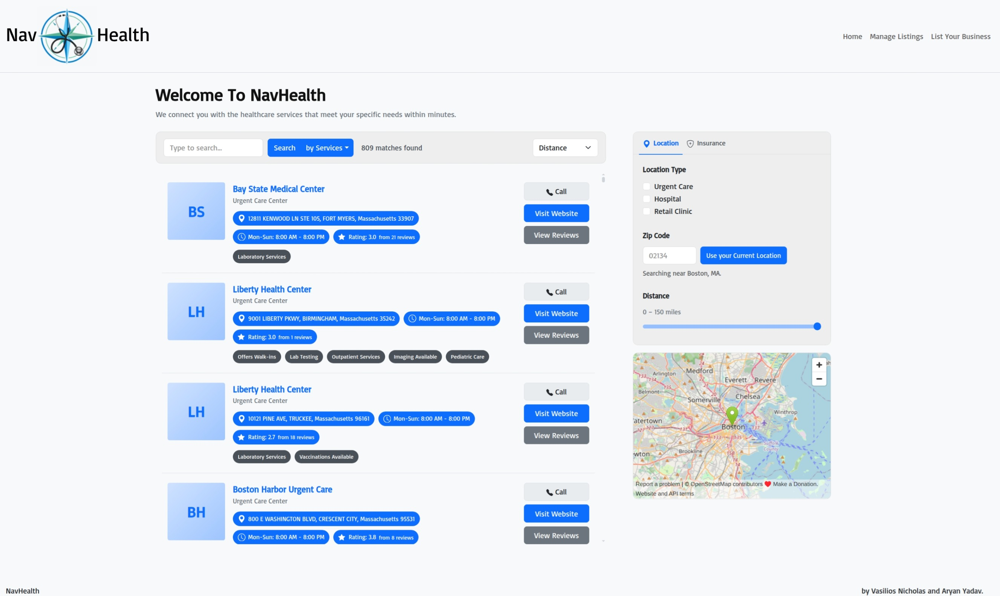
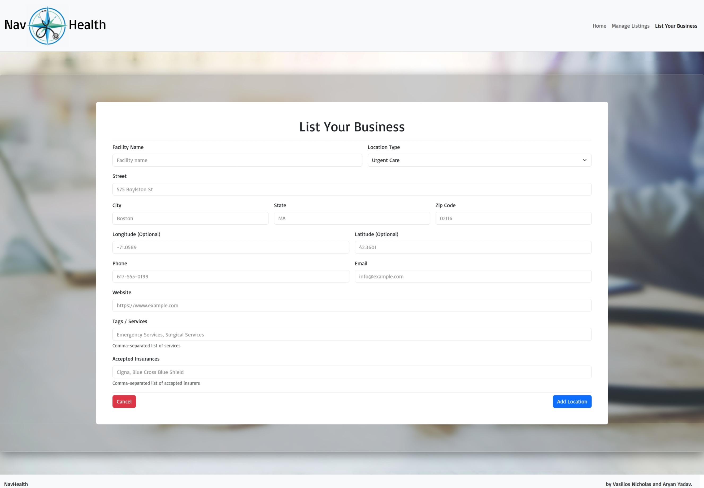
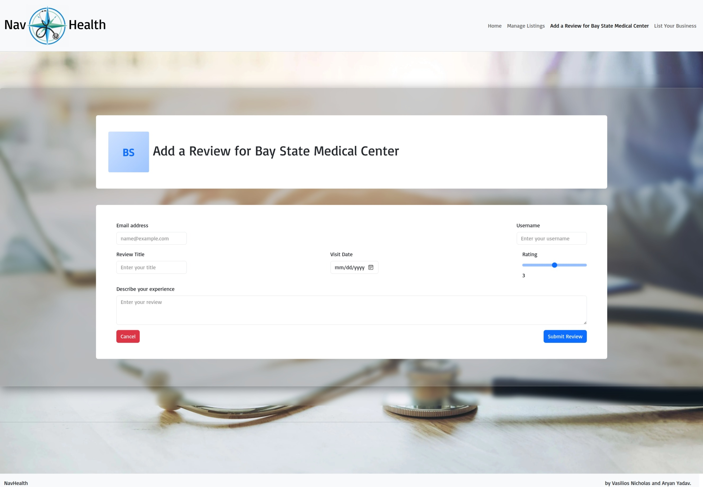
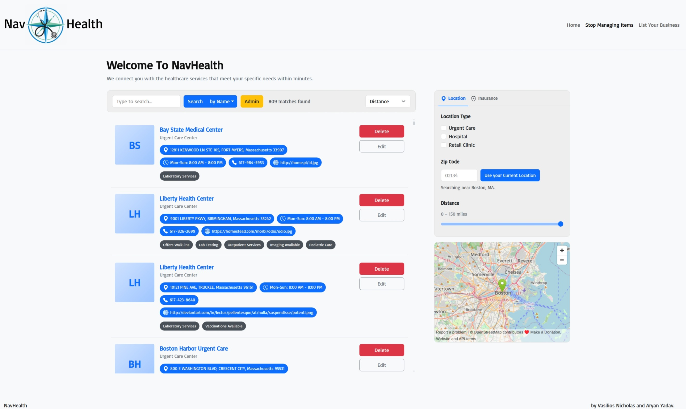

# NavHealth

**NavHealth** is a full-stack application that aggregates and displays information about healthcare resources, serving as a custom search engine focused on making it easy to find relevant health services near the end-user's location. It offers more information than a Google search or yelp listing, allowing users to search by healthcare services offered and filter locations by the insurances they accept. It also supports rating and reviewing healthcare businesses. Overall, NavHealth is designed to be a reliable endpoint for users seeking healthcare services to find the best facility to receive care at.
NavHealth was built with HTML5, CSS3, ES6, Node.js, Express, Bootstrap 5, and MongoDB.

For our live demo, our database hosts health facility locations with mock data for certain fields. The reviews collection is entirely composed of mock data.

> _Landing page of NavHealth._
> 
> _Search page of NavHealth._
> 
> _Reviews page of NavHealth._
> 
> _List Business page of NavHealth._
> 
> _Post Review page of NavHealth._
> 
> _Admin Search page of NavHealth._
> 
> _Admin Reviews page of NavHealth._
> 

## Live Demo and Documentation

- **[Deployed Site Link](https://navhealth.onrender.com/)**
- add video walk-through link
- **[Project slides](https://docs.google.com/presentation/d/1lVG5qM9A-txAdIopvvzvcrpaC5UkR5t9ZHaHdSgv4-E/edit?usp=sharing)**
- **[Design Document](https://docs.google.com/document/d/15TbOX519Nbn29X7LkZewL2eckoyTnjrVooJVtpLpPy0/edit?usp=sharing)**

## Authors
- Aryan Yadav: Search full-stack.
- Vasilios Nicholas: Reviews full-stack.

## Project Objective
The goal of NavHealth is to make finding healthcare services simpler and more informative than a typical Google or Yelp search. Users can search for health facilities by name, location, or services offered, filter results by accepted insurance providers, and read or post reviews — all in one place.

From a technical standpoint, the project was built to practice full-stack web development using Node.js, Express, MongoDB, and vanilla JavaScript with client-side rendering. Specific objectives include:

- Building a multi-page application where each page is served as its own HTML file with its own CSS and JS modules.
- Implementing a REST API with Express that supports full CRUD operations across two MongoDB collections: `locations` and `reviews`.
- Using client-side JavaScript (no frontend framework) to fetch data from the API and dynamically render UI elements.
- Integrating a third-party geocoding API to support location-aware search.
- Deploying the application to a public server so it is accessible to real users.

## Project Structure
```
NavHealth
├── eslint.config.js                            #eslint config file.
├── .env.example                                #example of the properties/attributes needed to run our app in a local/hosted environment.
├── LICENSE                                     #Our project uses an MIT license.
├── package.json                                #lists project dependencies.
├── package-lock.json
├── README.md                                   #project README
├── backend
│   ├── app.js                                  #Creates an instance of the express server, adds all routes, and starts the server.
│   ├── dev.js                                  #Runs our app using livereload, which hard refreshes our pages in a browser upon static file changes.
│   ├── index.js                                #Invokes imports app from app.js and invokes app.run() to run our app.
│   ├── database
│   │   ├── db.js                               #Singleton pattern for connecting to our MongoDB database using MongoClient.
│   │   └── reviewsCollectionOperations.js      #Service Module for interacting with our MongoDB singleton in db.js.
│   ├── routes
│   │   ├── categories.js
│   │   ├── insurances.js
│   │   ├── locations.js
│   │   └── ReviewsRouter.js                    #Router that contains CRUD operations for the reviews collection.
│   └── utils
│       └── geocodeMaps.js
├── data                                        #Final data in json format that was added to our MongoDB database.
│   └── processed
│       ├── locations.json
│       └── reviews.json
├── public                                      #Directory for static content.
│   ├── index.html                              #Landing page with initial search by health business name, location, or services offered.
│   ├── search.html                             #Search page displays results for initial and subsequent searches and adds more search features.
│   ├── reviews.html                            #Displays reviews for a particular location.
│   ├── add-location.html                       #Allows a business user to add a location to the NavHealth database.
│   ├── post-review.html                        #Allows a user to add a review for a location to the NavHealth database.
│   ├── images
│   │   ├── favicon.png                         #favicon for site.
│   │   ├── NavHealth.png                       #NavHealth logo.
│   │   └── splash.webp                         #Background image for most pages.
│   ├── scripts
│   │   ├── add-location.js
│   │   ├── DropDownGenerator.js                #Common code for generating and maintaining event listeners for a dropdown element.
│   │   ├── getInitials.js                      #Returns two chars from a String.
│   │   ├── landing.js                          #Frontend code for index.html.
│   │   ├── post-review.js                      #Frontend code for post-review.html.
│   │   ├── reviews.js
│   │   ├── SearchAndDropDownGenerator.js       #Links a datalist to a dropdown element, displaying new data on dropdown selection change.
│   │   ├── search.js
│   │   └── updateReviewsMetaData.js
│   └── styles
│       ├── main.css                            #main stylesheet.
│       ├── reviews.css                         #adds reviews-module specific styling.
│       └── search.css                          #adds search-module specific styling.
└── raw_data                                    #Directory for storing the raw data we used to build our MongoDB collections.
    ├── example-location.txt
    ├── FY24-Massachusetts-Hospital-Profiles-Databook.xlsx
    ├── mockaroo_generated_reviews.json
    ├── provider-list.txt
    └── Retail-and-Urgent-Care-Clinics-data-7-2024.xlsx
```

## Installation and Local Development

1. **Clone the repository using git**

   ```bash
   git clone https://github.com/vasiliosnicholas/NavHealth.git
   cd NavHealth
   ```

2. **Ensure Node.js v24 is installed on your system**

   ```bash
   node --version
   ```

3. **Install project dependencies for local deployment and development**
   ```bash
   npm install
   ```
4. **Install MongoDB on your system using a container or natively and start the MongoDB instance.**
5. **Add our collections from [./data/processed/](https://github.com/vasiliosnicholas/NavHealth/tree/main/data/processed) to a locally deployed MongoDB database.**
6. **Go to [https://geocode.maps.co/](https://geocode.maps.co/) and create an API key.**
7. **Using [.env.example](https://github.com/vasiliosnicholas/NavHealth/blob/main/.env.example) for the required environmental variables, fill out:**
   ```bash
    MONGODB_URI=<mongodb://localhost:27017 or your MongoDB cluster URI>
    MONGODB_DB_NAME=<your database name here>
    MONGODB_LOCATIONS_COLLECTION=<your collection name with the data from ./data/processed/locations.json>
    MONGODB_REVIEWS_COLLECTION=<your collection name with the data from ./data/processed/reviews.json>
    GEOCODE_MAPS_API_KEY=<your API key from step 6>
    ```
8. **Choose a script for running the app:**
    - If you plan to **develop**, we recommend using our start script, which runs our express server in a **livereload** server (which hard refreshes your browser for static file changes) and **nodemon** for restarting the server for dynamic file changes:
      ```bash
      npm start
      ```
    - Otherwise, run:
      ```bash
      node ./backend/index.js
      ```
## Gen AI Usage Disclosure

- Vasilios Nicholas:
  - App logo and favicon generation:
    - Model used: **GPT Image 2** via **Adobe Firefly**
    - Prompt used: Website faveicon/logo blue-green compass with a single black stethoscope. Ensure stethoscope is anatomically accurate.
  - **[Mockaroo](https://www.mockaroo.com/)** used for generating reviews mock data. See any of the objects in [./data/processed/reviews.json](https://github.com/vasiliosnicholas/NavHealth/blob/main/data/processed/reviews.json) to see the fields I used for generating the mock data.


## License
This project is licensed under the [MIT](https://github.com/vasiliosnicholas/NavHealth?tab=MIT-1-ov-file) License.
